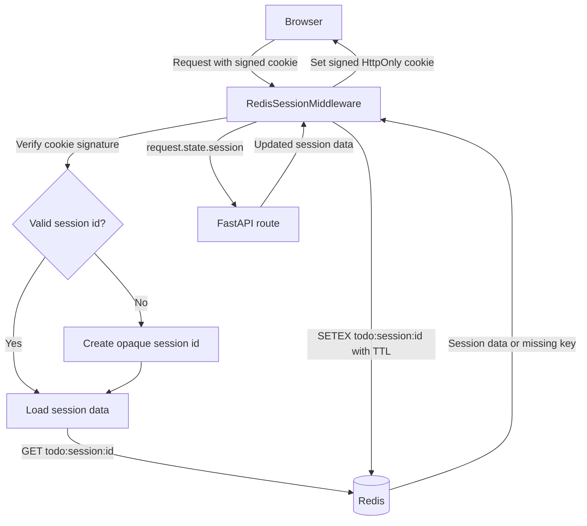

# Redis-Backed Sessions with TDD

This guide adds server-side sessions to the Todo API. The browser receives only a signed, opaque session identifier;
the session data itself lives in Redis. This is a good fit for authentication state, per-user preferences, and short-lived
workflow data. Do not put passwords, access tokens, or other secrets in session data.

The examples use the application's synchronous route style. Tests use a fake store, so the normal test suite does not
need a running Redis instance. A Redis container is used only when checking the infrastructure integration.

## What we will build

`GET /session` will create or resume a session and return a request counter. The flow is:



The cookie is `HttpOnly`, `SameSite=Lax`, and `Secure` in production. Redis keys are namespaced and receive a TTL, so
expired sessions are removed automatically.

## 1. Add configuration and dependencies

Install the Redis client and the signing library used by Starlette:

```bash
uv add redis itsdangerous
```

### Why these packages are needed

| Package | Why it is needed |
| --- | --- |
| `redis` | Provides the Python client that reads, writes, expires, and deletes the server-side session records in Redis. |
| `itsdangerous` | Signs the opaque session identifier stored in the cookie, so a browser cannot alter it to select another session. |

The Redis server is a separate service, not a Python package. The Docker command below starts it locally; managed Redis
or a TLS-protected Redis deployment should be used outside local development. `uv add` records the Python dependencies
in `pyproject.toml` and updates `uv.lock`, allowing the same versions to be installed with `uv sync`.

Add the following non-secret values to `.env.example`:

```dotenv
REDIS_URL=redis://:<redis-password>@localhost:6379/0
SESSION_COOKIE_NAME=todo_session
SESSION_TTL_SECONDS=1800
SESSION_SECRET=
SESSION_COOKIE_SECURE=false
```

### Local Redis password

When you authenticate from Redis CLI with `AUTH <password>`, Redis authenticates its enabled `default` user. Use a
password-only URL (`redis://:<password>@host:port/database`) in the application; adding a username such as `root` makes
the client request an ACL user that does not exist in a standard password-protected Redis server.

Create `redis.conf` locally (and add it to `.gitignore`):

```conf
requirepass <redis-password>
```

Start Redis with that ACL configuration:

```bash
docker run --name todo-redis \
  -p 6379:6379 \
  -v "$PWD/redis.conf:/usr/local/etc/redis/redis.conf:ro" \
  -d redis:7-alpine redis-server /usr/local/etc/redis/redis.conf
```

Put the credentialed URL in your ignored local `.env`, not `.env.example`. Replace `<redis-password>` with the password
used by `AUTH` in Redis CLI:

```dotenv
REDIS_URL=redis://:<redis-password>@localhost:6379/0
```

Verify the credentials and server connection:

```bash
docker exec todo-redis redis-cli --pass <redis-password> PING
```

The command should return `PONG`. The generic Docker command in the next section is an alternative for Redis without
authentication; do not run both containers with the same `todo-redis` name and port.

Generate the secret outside the repository, export it in the shell, and never commit it:

```bash
export SESSION_SECRET="$(python -c 'import secrets; print(secrets.token_urlsafe(32))')"
```

Use `SESSION_COOKIE_SECURE=true` behind HTTPS in staging and production. In a multi-instance deployment, every
instance must use the same `SESSION_SECRET` and Redis namespace.

Start Redis locally without authentication only when you do not use the ACL example above:

```bash
docker run --name todo-redis -p 6379:6379 -d redis:7-alpine
```

## 2. Start with a failing store test

Create `tests/unit/test_session_store.py` before adding production code. The store contract is deliberately small:
retrieve data, save data with a TTL, and delete data.

```python
"""Tests for Redis session persistence."""

from app.sessions.store import RedisSessionStore


class FakeRedis:
    """Minimal Redis double that records calls."""

    def __init__(self) -> None:
        self.values: dict[str, str] = {}
        self.ttls: dict[str, int] = {}

    def get(self, key: str) -> str | None:
        """Return a stored value."""
        return self.values.get(key)

    def setex(self, key: str, seconds: int, value: str) -> None:
        """Store a value and its expiry."""
        self.values[key] = value
        self.ttls[key] = seconds

    def delete(self, key: str) -> None:
        """Delete a value."""
        self.values.pop(key, None)


def test_save_load_and_delete_session() -> None:
    """Session values round-trip through the Redis store."""
    redis = FakeRedis()
    store = RedisSessionStore(redis, prefix="todo:session:", ttl_seconds=1800)

    store.save("session-id", {"visits": 1})

    assert redis.ttls["todo:session:session-id"] == 1800
    assert store.load("session-id") == {"visits": 1}

    store.delete("session-id")

    assert store.load("session-id") is None


def test_load_returns_none_for_missing_or_invalid_json() -> None:
    """Missing and corrupted Redis values are not trusted as sessions."""
    redis = FakeRedis()
    store = RedisSessionStore(redis, prefix="todo:session:", ttl_seconds=1800)
    redis.values["todo:session:broken"] = "not-json"

    assert store.load("missing") is None
    assert store.load("broken") is None
```

Run it. It should fail because `app.sessions` does not exist yet:

```bash
uv run pytest tests/unit/test_session_store.py
```

## 3. Implement the Redis boundary

Create `app/sessions/__init__.py`, then create `app/sessions/store.py`:

```python
"""Redis persistence for server-side session data."""

from __future__ import annotations

import json
from collections.abc import Mapping
from typing import Protocol


SessionData = dict[str, int | str | bool]


class RedisClient(Protocol):
    """The subset of the synchronous Redis client used by the store."""

    def get(self, name: str) -> str | bytes | None:
        """Return the value for a key."""

    def setex(self, name: str, time: int, value: str) -> object:
        """Set a value with an expiry in seconds."""

    def delete(self, *names: str) -> object:
        """Delete one or more keys."""


class RedisSessionStore:
    """Store JSON-serializable session data under a namespaced Redis key."""

    def __init__(self, client: RedisClient, prefix: str, ttl_seconds: int) -> None:
        """Configure a session store backed by a Redis client."""
        if ttl_seconds <= 0:
            raise ValueError("ttl_seconds must be positive")
        self._client = client
        self._prefix = prefix
        self._ttl_seconds = ttl_seconds

    def load(self, session_id: str) -> SessionData | None:
        """Return valid session data, or None when it is absent or invalid."""
        raw_value = self._client.get(self._key(session_id))
        if raw_value is None:
            return None
        try:
            decoded = raw_value.decode() if isinstance(raw_value, bytes) else raw_value
            data = json.loads(decoded)
        except (UnicodeDecodeError, json.JSONDecodeError):
            return None
        if not isinstance(data, dict) or not all(isinstance(key, str) for key in data):
            return None
        if not all(isinstance(value, (str, int, bool)) for value in data.values()):
            return None
        return data

    def save(self, session_id: str, data: Mapping[str, int | str | bool]) -> None:
        """Persist session data and refresh its expiry."""
        self._client.setex(self._key(session_id), self._ttl_seconds, json.dumps(dict(data)))

    def delete(self, session_id: str) -> None:
        """Remove a session from Redis."""
        self._client.delete(self._key(session_id))

    def _key(self, session_id: str) -> str:
        """Return the Redis key for a session identifier."""
        return f"{self._prefix}{session_id}"
```

Re-run the focused test until it passes. The store has no FastAPI dependency, which makes malformed data and TTL behavior
easy to test independently.

## 4. Add a middleware test before the middleware

Create `tests/integration/test_session_routes.py`. This verifies the public behavior through the same `TestClient` used
by the Todo routes. The shared autouse fixture in `tests/conftest.py` assigns a fake to `app.state.session_store`, which
is where the middleware obtains its store; this avoids Redis in the normal test suite. A session-specific test may
replace that fake when it needs to inspect persisted data directly.

`TestClient` enters the FastAPI lifespan, which calls `create_db_and_tables()`. Ensure the shared `tests/conftest.py`
sets `os.environ["DATABASE_URL"] = "sqlite://"` before it imports any `app` module. `python-dotenv` will then leave that
value intact, so these tests use in-memory SQLite rather than the PostgreSQL URL in a developer's `.env`. See
[Step 1.4.2 in the TDD guide](tdd-fastapi.md#step-142-force-sqlite-for-pytest) for the complete shared fixture.

```python
"""Integration tests for Redis-backed sessions."""

from collections.abc import Mapping

import pytest
from fastapi.testclient import TestClient

from app.main import app


class MemorySessionStore:
    """In-memory implementation for route tests."""

    def __init__(self) -> None:
        self.data: dict[str, dict[str, int | str | bool]] = {}

    def load(self, session_id: str) -> dict[str, int | str | bool] | None:
        """Load a session."""
        return self.data.get(session_id)

    def save(self, session_id: str, data: Mapping[str, int | str | bool]) -> None:
        """Save a session."""
        self.data[session_id] = dict(data)

    def delete(self, session_id: str) -> None:
        """Delete a session."""
        self.data.pop(session_id, None)


@pytest.fixture
def client() -> TestClient:
    """Return a client using an in-memory session store."""
    app.state.session_store = MemorySessionStore()
    with TestClient(app) as test_client:
        yield test_client
    del app.state.session_store


def test_session_counter_is_preserved_for_the_same_client(client: TestClient) -> None:
    """A session is created once and restored from its cookie."""
    assert client.get("/session").json() == {"visits": 1}
    assert client.get("/session").json() == {"visits": 2}


def test_tampered_session_cookie_starts_a_new_session(client: TestClient) -> None:
    """An invalid signed cookie cannot select another user's session."""
    client.cookies.set("todo_session", "not-a-valid-signature")

    response = client.get("/session")

    assert response.status_code == 200
    assert response.json() == {"visits": 1}
```

This test describes an implementation detail worth preserving: routes should access session data through
`request.state.session`, while the middleware owns cookies and persistence. Do not expose a client-selected Redis key.

## 5. Implement the session middleware and route

Create a `SessionStore` protocol in `app/sessions/store.py` (with `load`, `save`, and `delete` signatures matching the
methods above). Then add `app/sessions/middleware.py`. It should obtain that protocol implementation from
`request.app.state.session_store` and use `itsdangerous.URLSafeSerializer` with a dedicated salt to:

1. Read and verify the cookie.
2. Generate a `secrets.token_urlsafe(32)` session id if verification fails or the Redis record is missing.
3. Load the dictionary into `request.state.session`.
4. After the response, save the dictionary with `store.save()` and set a signed cookie for the id.

Cookie creation should use these options:

```python
response.set_cookie(
    key=settings.session_cookie_name,
    value=serializer.dumps(session_id),
    max_age=settings.session_ttl_seconds,
    httponly=True,
    secure=settings.session_cookie_secure,
    samesite="lax",
    path="/",
)
```

In `app/main.py`, validate `SESSION_SECRET` and a positive `SESSION_TTL_SECONDS` at application import, then configure
the production Redis store during lifespan startup. Preserve an existing store so the test fixture can supply its fake:

```python
if not hasattr(_app.state, "session_store"):
    redis_url = os.getenv("REDIS_URL")
    if not redis_url:
        raise RuntimeError("REDIS_URL environment variable is required")
    redis_client = Redis.from_url(redis_url, decode_responses=True)
    _app.state.session_store = RedisSessionStore(
        redis_client,
        prefix="todo:session:",
        ttl_seconds=SESSION_TTL_SECONDS,
    )
```

Mount `RedisSessionMiddleware` with the validated secret, cookie name, TTL, and secure-cookie setting. It loads the
signed cookie into `request.state.session` before the route runs, then saves the session and refreshes the cookie after
the response. Do not silently fall back to an in-memory store in production; the in-memory store belongs only in tests.

Finally, mount the middleware in `app/main.py` and add a small route:

```python
@app.get("/session")
def get_session(request: Request) -> dict[str, int]:
    """Increment and return the current session's visit count."""
    visits = int(request.state.session.get("visits", 0)) + 1
    request.state.session["visits"] = visits
    return {"visits": visits}
```

Run the focused integration test, then the complete suite:

```bash
uv run pytest tests/integration/test_session_routes.py
uv run pytest
```

## 6. Verify Redis locally

With Redis running and `SESSION_SECRET` exported, start the API:

```bash
uv run uvicorn app.main:app --reload
```

Make two requests while retaining cookies:

```bash
curl -c cookies.txt http://127.0.0.1:8000/session
curl -b cookies.txt -c cookies.txt http://127.0.0.1:8000/session
```

The responses should show `{"visits":1}` then `{"visits":2}`. Redis should contain a key beginning with
`todo:session:`; its value must be JSON session data, never the signing secret.

### Inspect the session in Redis

After calling `/session`, enter the Redis password without echoing it, then list the stored session keys:

```bash
printf "Redis password: "
read -r -s REDIS_PASSWORD
printf "\n"
export REDIS_PASSWORD

docker exec -e REDISCLI_AUTH="$REDIS_PASSWORD" todo-redis \
  redis-cli --scan --pattern 'todo:session:*'
```

Copy one returned key and inspect its data and remaining expiry. Replace `todo:session:<session-id>` with the exact key
printed by the scan command:

```bash
docker exec -e REDISCLI_AUTH="$REDIS_PASSWORD" todo-redis \
  redis-cli GET 'todo:session:<session-id>'

docker exec -e REDISCLI_AUTH="$REDIS_PASSWORD" todo-redis \
  redis-cli TTL 'todo:session:<session-id>'
```

The `GET` result should contain JSON such as `{"visits": 2}`, and `TTL` should return a positive number no greater than
`SESSION_TTL_SECONDS`. Do not paste the signed browser cookie into Redis commands: it is not the Redis key.

## 7. Add the remaining tests before expanding session use

Before using sessions for login or authorization, add focused tests for these cases:

- An expired or deleted Redis key produces a fresh session and new cookie.
- Redis unavailable during a session read or write returns a deliberate `503`, without leaking connection details.
- Logout deletes the Redis key and clears the cookie with the same `path`, `samesite`, and `secure` attributes.
- A session cannot be replayed after logout.
- A production configuration with an empty `SESSION_SECRET`, non-positive TTL, or malformed `REDIS_URL` fails startup.

For real authentication, rotate the session id immediately after login and again after privilege changes. Store only a
small user identifier and authorization version in the session; look up permissions from the database on sensitive
requests. This limits session fixation, stale permissions, and the impact of a Redis data leak.

## Operational notes

- Use a TLS Redis endpoint and authentication outside local development.
- Restrict Redis network access to the API, and set a memory/eviction policy that accounts for session TTLs.
- Keep Redis keys namespaced, for example `todo:session:`, to prevent collisions with other application data.
- Log request ids and session-store failures, but never log cookies, session ids, or session contents.
- Set CORS `allow_origins` to explicit frontend origins before relying on cookie-based browser sessions. `allow_origins=["*"]`
  cannot safely be used with credentialed cross-origin requests.
